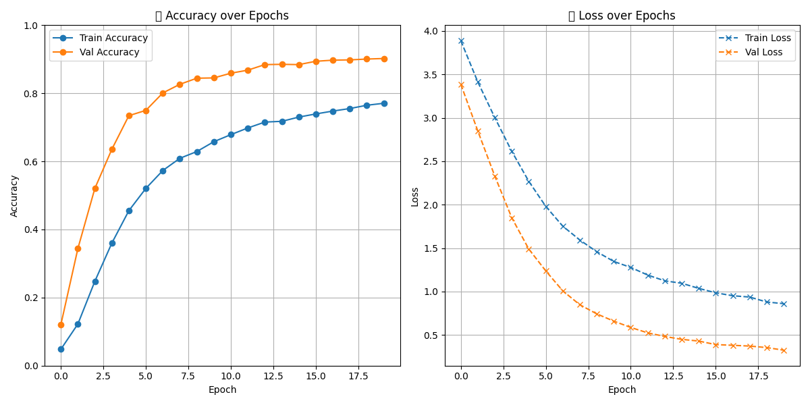

# 🧠 Smart Image Classifier

A deep learning project that classifies real-world images (animals, vehicles, devices, etc.) using a fine-tuned [MobileNetV2](https://keras.io/api/applications/mobilenet/) model.  
The app is deployed using [Streamlit Cloud](https://streamlit.io/cloud).

---

## 🚀 Demo

🔗 [Live App on Streamlit](https://smart-classifier-rzrzydeb6raves5mx9scuq.streamlit.app)

You can upload an image or paste a link, and the model will instantly predict the object and show class probabilities.

---

## 🧩 Features

- Fine-tuned CNN (MobileNetV2) on custom dataset (39 categories)
- Real-time image classification via web interface
- Shows:
  - Predicted class
  - Confidence level
  - Top-3 predictions
  - All class probabilities (bar chart)
- Download prediction as JSON
- History tracking of predictions
- Streamlit-based frontend (dark style + responsive)

---

## 🗂 Dataset

Custom dataset built from:
- 🔍 `icrawler` (Bing Images)
- 📦 [OpenImages V7](https://storage.googleapis.com/openimages/web/index.html)

Includes 39 classes like:

```text
cat, dog, lion, elephant, zebra, car, truck, airplane, train, phone, television, book, laptop, chair, keyboard, sofa, fridge, fan, motorcycle, etc.
🛠️ Tech Stack
TensorFlow / Keras (model training)

MobileNetV2 (base model)

Streamlit (web app)

Pandas, Matplotlib, icrawler

h5, json, csv (export results)

📦 Installation

git clone https://github.com/ALBADWIMAJID/smart-classifier.git
cd smart-classifier
pip install -r requirements.txt
streamlit run app.py
🖼️ Example
 <p align="left">  <b>Predicted:</b> Phone<br> <b>Confidence:</b> 86.07% </p>
📁 Project Structure

├── app.py                     # Streamlit app

├── fine_tune_mobilenet.py     # Training code

├── unfreeze_model.py          # Optional: unfreeze base layers

├── analyze_dataset.py         # Dataset analysis tool

├── download_images_full.py    # Download script (icrawler)

├── models/

│   ├── mobilenet_finetuned.h5

│   ├── fine_tune_plot.png

│   └── class_names.json

├── dataset/                   # Image dataset (39 classes)

├── requirements.txt

└── README.md

📊 Results

Final validation accuracy: ~85% after fine-tuning
Includes detailed metrics (CSV + plots)

📚 License
This project is under the MIT License.

Made with ❤️ by ALBADWIMAJID


